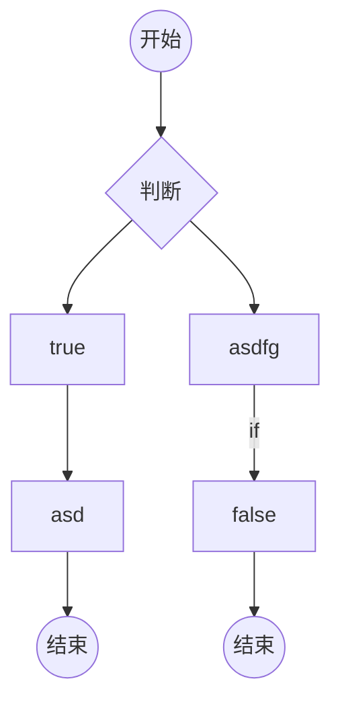
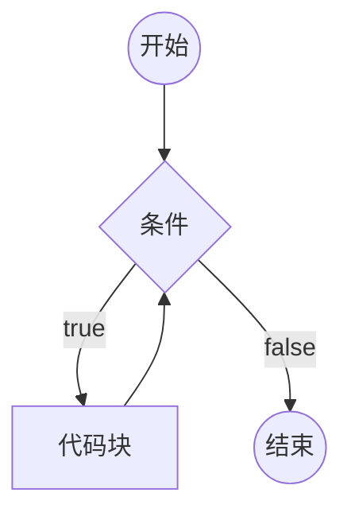
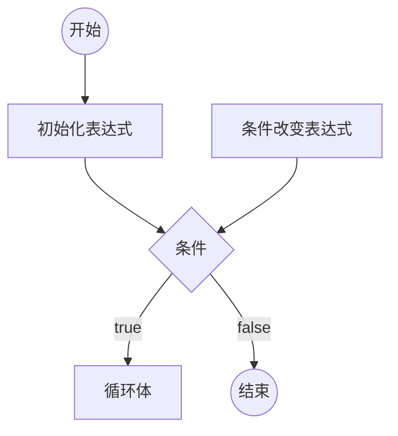

# 流程控制

## 流程图

一套的标准的图形,用于描述程序的逻辑

通常流程图分析程序的流程

> markdown中粘贴图片, ctrl + alt + v

### 在markdown 中画流程图



## if判断

```js
if(条件1){
    // 代码块
}
else if(条件2){
    // 代码块
}
else if(条件3){
    // 代码块
}
//...
else{
    // 以上条件都不满足执行的代码块
}
```

1. 如果某个条件满足,则直接忽略后面所有条件
2. else if 可以有多个(包含0个)
3. else可以有1个或0个
4. else可以换行,可以不换行
5. 如果代码块只有一条语句,可以省略花括号(不推荐)  
6. if只能出现一次

### 补充

用户输入: propmt("提示文本");

该表达式返回结果:

1. null: 表示用户点击了取消
2. 用户输入的字符串: 表示用户点击了确定,得到用户输入的结果

返回类型: null 或 字符串 

将字符串转换成数字: +字符串

## switch 开关

```js
// switch(表达式){
    // case 数据1:
          // 代码块
    // case 数据2:
    //       代码块
    //...
    // default:
    //       代码块  
// }
var x = 20;
switch (x){
    case 1:
        console.log("1");
        break;
    case 20:
        console.log("20");
        break;
    case 30:
        console.log("30");
        break;
    default:
        console.log("default");
        break;
}
```

1. 计算表达式的返回值,依次和case后面的数据进行严格相等的比较,如果某个相等,停止比较,然后运行其内部的代码块,再然后,依次运行之后的所有代码块
2. 在case分支内部,使用break语句,可以立即停止switch
3. default表示前面的所有case都不匹配时运行,可以省略

## 循环

重复的运行一段代码

JS支持3种循环结构: for循环、while循环、do-while循环

### while循环


```js
whilt(条件){
    代码块(循环体)
}
```



死循环: 条件永远满足,用还无法退出循环

### do-while循环

```js
do{
    循环体
}while(条件);
```

```mermaid
graph TD

st((开始)))-->代码块
代码块-->条件{条件}
条件--true-->代码块
条件--false-->ed((结束))
```

### for循环

```js
for(初始化表达式;条件;条件改变表达式){
    循环体
}
```



### 循环种的关键字

循环控制语句

- break: 跳出循环
- continue: 停止当前循环,进行下一次循环

## 循环应用

### 累计

举例: 将1-100的所有数字相加之和

思路: 准备一个变量,初始值为0,然后1-100循环,每次循环,将数字累加到变量中

```js
// 累加
var sum = 0; // 设置一个值为0的变量
for(i = 0;i <=100;i++){
    sum +=i;
}
console.log(sum);
```

### 查找 

举例: 135~145之间是否存在能整除26的数字

思路: 准备一个变量,记录false,表示没有找到,然后135-145进行循环,如果发现满足条件的数字,重新记录变量为true,表示找到了,然后退出循环

```js
// 135-145 之间是否存在 能整除26的数字
var isFind = false; // 是否找到
var min = 135;
var max = 145;
for (var i = min; i <= max;i++){
    if (i % 26 ===0){
        isFind = true;
        break;
    }
    if (isFind){
        console.log("存在");
    }
    else{
        console.log("不存在");
    }
}
```

```js
// 判断一个数是不是素数 (质数)
// 素数: 一个大于1的整数,只能被1和自身整除
// 比如: 2是一个素数
// 比如: 4不是一个素数
// 思路: 从1循环到这个数,记录有多少个数字能整除它
var num = 104;
var record = 0; // 记录整除数量
for(var i = 1;i <= num;i++){
    if(num % i === 0){
        record++;
    }
}
if(record === 2){
    console.log("是素数");
}
else{
    console.log("不是素数");
}
```

### 嵌套的循环

分开分析两层循环

## 数组

### 创建一个数组

1. new Array(长度)

长度,数组里面的数据总数,长度一定是一个非负整数

new Array(数据,数据,数据....)

创建一个数组,并初始化其每一项的值

数组项: 数组其中的一项数据

2. [数据,数据,数据,....]

创建一个数据,并初始化其每一项的值

### 认识数组

数组的本质是一个对象

- length属性: 数组的长度,会自动变化,值为最大下标+1
- 数字字符串属性: 叫做下标,也叫做索引,相当于数组中每个数据的编号,下标从0开始排列

连续下标的取值范围: 0 ~ length - 1, 如果给length直接赋值,会导致数组可能被截断

实际开发中,不要给length赋值

### 下标

通常情况下,下标是连续的

下标不连续的数字,叫做稀松数组

### 数组的常见操作

#### 添加数组项

* 数组[长度] = 数据 : 向数组末尾添加一个数据
* 数组.push(数据) : 向数组末尾添加一个数据
* 数组.unshift(数组) : 像数组起始位置添加一个数据,会导致数组每一项的下标向后移动
* 数组.splice(下标,0,添加的数据): 从指定下标位置开始,删除0个,然后在该位置往后插入添加的数据,如果下标超过范围,则按照范围的边界进行处理

push 和 unshift 和 splicee可以添加多个数据 用逗号分隔

#### 删除数据

* delete 数组[下标] : 这种做法不会导致数组其他的属性发生变化,因此,该做法会导致缠讼稀松数组,所以不推荐该做法
* 数组.pop(): 删除数组的最后一项,该表达式返回最后一项的数据
* 数组.shift(): 删除数组的第一项该表达式返回第一项的数据
* 数组.splice(下标,删除的数量,添加的数据): 从指定下标位置开始,删除指定数量,然后在该位置插入添加的数据,如果下标超过范围,则按照范围的边界进行处理,返回一个新数组,该数组记录被删除的数据

#### 其他操作

* 数组.slice(起始位置下标,结束位置下标): 从起始位置到结束位置之间的数据拿出来,结束下标取不到,得到一个新的数组,该函数不会改变原数组,只写起始下标,则后面直接取完,注意: 不写参数则直接截取整个数组

下标可以写负数,如果是负数,则从数组的末尾开始计算

如果不写结束下标,则直接取到末尾

* 数组清空
  
数组.splice(0,数组.length); 数组的长度,清除剩余0位,有返回值

数组.length = (0);

* 查找数组中某一项的下标
  
数组.indexof(数据)

从数组中依次查找对应的数据,查找时使用严格的相等进行比较,如果找到则返回这个匹配的下标,返回,如果没有找到则得到 -1

* 数组.fill

数组.fill(数组): 将数组的所有项,填充为指定的数据

数组.fill(数组,开始下标): 将数组从开始下标起,到数组的末尾,填充为指定的数据

数组.fill(数组,开始下标,结束下标): 将数组从开始下标起,到数组的结束下标(取不到),填充为指定的数据

* 数组.join(分隔符),该函数返回一个字符串

```js
var str = arr.join(",");

// 所有数字下面都有逗号处末尾
```

* 数组1.concat(数组2);

将数组2的所有元素拼接到数组1的末尾,产生一个新数组返回,该表达式不会对原数组造成任何影响

```js
var newArr = arr1.concat(arr2);
```

### 新语法补充

#### in关键字

判断某个属性在对象中是否存在

属性名 in 对象

#### for -in循环

```js
// 得到对象的下标
// 下标
for (var prop in 对象){

}
```

```js
// 得到数组的值
for (var prop in arr){
    console.log(arr[prop]);
}
```

取出对象的所有属性名,每次循环将其中一个属性名赋值给变量prop,运行循环体

**最大的区别**

for in 循环的是下标,如果你没有写循环不到,不会循环到稀松数组

for 循环是依次循环,没有写也循环

```js
数组名.forEach(function(循环的值,下标,数组本身)){
    // forEach()方法需要一个函数作为参数
    // - 像这种函数,由我们创建但是不由我们调用,我们称为回调函数
    // - 数组中有几个元素函数就会执行几次,浏览器会将遍历到的元素以实参的形式传递进来
    // 我们可以定义形参,来读取这些内容
    // 浏览器会在回调函数中传递三个参数
    // 第一个参数,就是当前正在遍历的元素,第二个参数就是当前正在遍历的索引,第三个参数,返回这个数组
    // 这个方法只支持IE8以上的浏览器,以下不支持
}
```